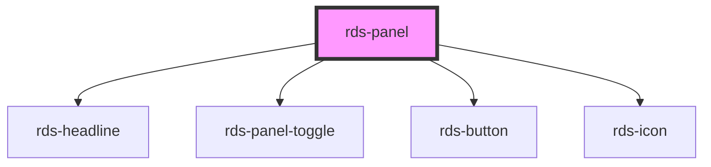

## rds-panel Readme

<rds-alert appearance="info" visible>
  
    React Integration Notes
  
  
    Component events can be used two ways:   
    Events will commonly be used as a React prop, in which case, they will be prefixed with 'on' and use camel case. Example: The React prop for the event `rdsOnChange` is `onRdsOnChange`.   
    Alternatively, you can attach an event listener to the component, in which case the event name remains the same.
  
</rds-alert>

<!-- Auto Generated Below -->

### Properties

| Property            | Attribute             | Description                                                                                                           | Type                         | Default     |
| ------------------- | --------------------- | --------------------------------------------------------------------------------------------------------------------- | ---------------------------- | ----------- |
| `closeButton`       | `close-button`        | If `true`, the panel will display a close button in the top right corner.                                             | `boolean`                    | `true`      |
| `disableBodyScroll` | `disable-body-scroll` | If `true`, a fixed panel will disable the body scrollbar when open.                                                   | `boolean`                    | `true`      |
| `disabled`          | `disabled`            | If `true`, the panel is disabled.                                                                                     | `boolean`                    | `false`     |
| `level`             | `level`               | Sets the panel's headline level.                                                                                      | `1 , 2 , 3 , 4 , 5 , 6` | `5`         |
| `noPadding`         | `no-padding`          | Removes padding inside the panel.                                                                                     | `boolean`                    | `false`     |
| `panelId`           | `panel-id`            | Sets the ID of the panel.                                                                                             | `string`                     | `undefined` |
| `panelTitle`        | `panel-title`         | Sets the panel's title.                                                                                               | `string`                     | `undefined` |
| `position`          | `position`            | When position is set to fixed, the panel will overlay content. Set position to 'push' to set display to inline-block; | `"fixed" , "push"`          | `'fixed'`   |
| `wide`              | `wide`                | If `true`, the panel to span 1/2 width of screen.                                                                     | `boolean`                    | `false`     |

### Events

| Event            | Description                                   | Type                                  |
| ---------------- | --------------------------------------------- | ------------------------------------- |
| `rdsDidClose`    | Emitted when the panel is closed.             | `CustomEvent<void>`                   |
| `rdsDidOpen`     | Emitted when the panel is open.               | `CustomEvent<void>`                   |
| `rdsPanelChange` | Emitted when the panel state is changed.      | `CustomEvent<PanelChangeEventDetail>` |
| `rdsWillClose`   | Emitted when the panel is about to be closed. | `CustomEvent<void>`                   |
| `rdsWillOpen`    | Emitted when the panel is about to be opened. | `CustomEvent<void>`                   |

### Methods

#### `close() => Promise<boolean>`

Closes the panel.

##### Returns

Type: `Promise<boolean>`

#### `isActive() => Promise<boolean>`

Returns `true` if the panel is active.

##### Returns

Type: `Promise<boolean>`

#### `isOpen() => Promise<boolean>`

Returns `true` if the panel is open.

##### Returns

Type: `Promise<boolean>`

#### `open() => Promise<boolean>`

Opens the panel.

##### Returns

Type: `Promise<boolean>`

#### `setOpen(shouldOpen: boolean) => Promise<boolean>`

Opens or closes the panel.
If the operation can't be completed successfully, it returns `false`.

##### Returns

Type: `Promise<boolean>`

#### `toggle() => Promise<boolean>`

Toggles the panel. If the panel is already open, it will try to close, otherwise it will try to open it.
If the operation can't be completed successfully, it returns `false`.

##### Returns

Type: `Promise<boolean>`

### Slots

| Slot                 | Description                                                                                                                                                         |
| -------------------- | ------------------------------------------------------------------------------------------------------------------------------------------------------------------- |
| `"action-primary"`   | Use this slot to add a primary action to your panel. Panel actions remain fixed to the top part of panel, underneath the headline's slot (if provided).             |
| `"action-secondary"` | Use this slot to add a secondary action to your panel. Panel actions remain fixed to the top part of panel, underneath the headline's slot (if provided).           |
| `"action-text"`      | Use this slot to add text to describe the actions in your panel. Panel actions remain fixed to the top part of panel, underneath the headline's slot (if provided). |
| `"headline"`         | Use this slot to add a custom headline and/or header components to the top of your panel.                                                                           |
| `"panel-details"`    | Use this slot to add content to the body of your panel. You may create multiple slots using the name 'panel-details' to keep your content organized.                |
| `"panel-footer"`     | The panel-footer slot is a fixed region for additional panel details that shouldn't scroll with panel contents.                                                     |

### Shadow Parts

| Part          | Description                                                               |
| ------------- | ------------------------------------------------------------------------- |
| `"action"`    | The container for `action-text`, `action-primary` and `action-secondary`. |
| `"container"` | The container for `panel-details`.                                        |

### Dependencies

#### Depends on

- [rds-headline](../rds-headline)
- [rds-panel-toggle](../rds-panel-toggle)
- [rds-button](../rds-button)
- [rds-icon](../rds-icon)

#### Graph

----------------------------------------------

 
