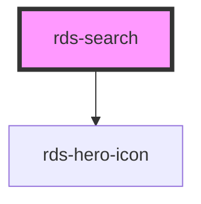

## rds-search Readme

<rds-alert appearance="info" visible>
  
    React Integration Notes
  
  
    Component events can be used two ways:   
    Events will commonly be used as a React prop, in which case, they will be prefixed with 'on' and use camel case. Example: The React prop for the event `rdsOnChange` is `onRdsOnChange`.   
    Alternatively, you can attach an event listener to the component, in which case the event name remains the same.
  
</rds-alert>

<!-- Auto Generated Below -->

### Properties

| Property       | Attribute      | Description                                                                                             | Type                                                                                                                                                                                                                                                                                                                                                                                                                                                                                                                                                                                                                                                                                                                                                                                                                                                                                                                        | Default    |
| -------------- | -------------- | ------------------------------------------------------------------------------------------------------- | --------------------------------------------------------------------------------------------------------------------------------------------------------------------------------------------------------------------------------------------------------------------------------------------------------------------------------------------------------------------------------------------------------------------------------------------------------------------------------------------------------------------------------------------------------------------------------------------------------------------------------------------------------------------------------------------------------------------------------------------------------------------------------------------------------------------------------------------------------------------------------------------------------------------------- | ---------- |
| `autocomplete` | `autocomplete` | Indicates whether the value of the control can be automatically completed by the browser.               | `"on" , "off" , "name" , "honorific-prefix" , "given-name" , "additional-name" , "family-name" , "honorific-suffix" , "nickname" , "email" , "username" , "new-password" , "current-password" , "one-time-code" , "organization-title" , "organization" , "street-address" , "address-line1" , "address-line2" , "address-line3" , "address-level4" , "address-level3" , "address-level2" , "address-level1" , "country" , "country-name" , "postal-code" , "cc-name" , "cc-given-name" , "cc-additional-name" , "cc-family-name" , "cc-number" , "cc-exp" , "cc-exp-month" , "cc-exp-year" , "cc-csc" , "cc-type" , "transaction-currency" , "transaction-amount" , "language" , "bday" , "bday-day" , "bday-month" , "bday-year" , "sex" , "tel" , "tel-country-code" , "tel-national" , "tel-area-code" , "tel-local" , "tel-extension" , "impp" , "url" , "photo"` | `'off'`    |
| `debounce`     | `debounce`     | Set the amount of time, in milliseconds, to wait to trigger the `rdsChange` event after each keystroke. | `number`                                                                                                                                                                                                                                                                                                                                                                                                                                                                                                                                                                                                                                                                                                                                                                                                                                                                                                                    | `250`      |
| `disabled`     | `disabled`     | If `true`, the user cannot interact with the input.                                                     | `boolean`                                                                                                                                                                                                                                                                                                                                                                                                                                                                                                                                                                                                                                                                                                                                                                                                                                                                                                                   | `false`    |
| `placeholder`  | `placeholder`  | Sets the input's placeholder text.                                                                      | `string`                                                                                                                                                                                                                                                                                                                                                                                                                                                                                                                                                                                                                                                                                                                                                                                                                                                                                                                    | `'Search'` |
| `value`        | `value`        | The value of the search input.                                                                          | `string`                                                                                                                                                                                                                                                                                                                                                                                                                                                                                                                                                                                                                                                                                                                                                                                                                                                                                                                    | `''`       |

### Events

| Event       | Description                                     | Type                                   |
| ----------- | ----------------------------------------------- | -------------------------------------- |
| `rdsBlur`   | Emitted when the input loses focus.             | `CustomEvent<void>`                    |
| `rdsCancel` | Emitted when the cancel button is clicked.      | `CustomEvent<void>`                    |
| `rdsChange` | Emitted when the value has changed.             | `CustomEvent<SearchChangeEventDetail>` |
| `rdsClear`  | Emitted when the clear input button is clicked. | `CustomEvent<void>`                    |
| `rdsFocus`  | Emitted when the input has focus.               | `CustomEvent<void>`                    |
| `rdsInput`  | Emitted when a keyboard input occurred.         | `CustomEvent<KeyboardEvent>`           |

### Methods

#### `setFocus() => Promise<void>`

Sets focus on the specified `rds-search`. Use this method instead of the global
`input.focus()`.

##### Returns

Type: `Promise<void>`

### Dependencies

#### Depends on

- [rds-hero-icon](../rds-hero-icon)

#### Graph

----------------------------------------------

_Built for Resilience Design System @ FM Global_
