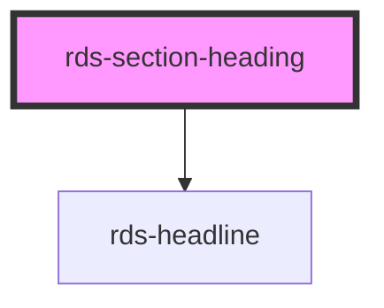

## rds-section-heading Readme

<!-- Auto Generated Below -->

### Properties

| Property | Attribute | Description                                 | Type                         | Default     |
| -------- | --------- | ------------------------------------------- | ---------------------------- | ----------- |
| `level`  | `level`   | Sets the section's headline level.          | `1 , 2 , 3 , 4 , 5 , 6` | `3`         |
| `text`   | `text`    | Text that is displayed as the page heading. | `string`                     | `undefined` |

### Slots

| Slot                 | Description                                                                       |
| -------------------- | --------------------------------------------------------------------------------- |
| `"action-primary"`   | This slot can be used to place one or more RdsButtons or other primary actions.   |
| `"action-secondary"` | This slot can be used to place one or more RdsButtons or other secondary actions. |
| `"content"`          | This slot is used to place RDS components inside below the headline.              |

### Dependencies

#### Depends on

- [rds-headline](../rds-headline)

#### Graph

----------------------------------------------

_Built for Resilience Design System @ FM Global_
