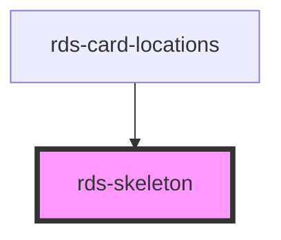

## rds-skeleton Readme

<!-- Auto Generated Below -->

### Properties

| Property       | Attribute       | Description                                             | Type     | Default  |
| -------------- | --------------- | ------------------------------------------------------- | -------- | -------- |
| `count`        | `count`         | Number of rows of current skeleton type                 | `number` | `1`      |
| `height`       | `height`        | Height of the skeleton. Include px like '100px'.        | `string` | `null`   |
| `marginBottom` | `margin-bottom` | Optional bottom margin of the skeleton ex. 10px, 0 etc. | `string` | `null`   |
| `variant`      | `variant`       | Variant of the skeleton 'circle' , 'rect' , 'text'    | `string` | `'text'` |
| `width`        | `width`         | Width of the skeleton. Include px like '100px'.         | `string` | `null`   |

### Dependencies

#### Used by

 - [rds-card-locations](../rds-card-locations)

#### Graph

----------------------------------------------

_Built for Resilience Design System @ FM Global_
