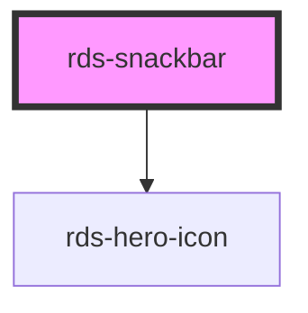

## rds-snackbar Readme

<rds-alert appearance="info" visible>
  
    React Integration Notes
  
  
    Component events can be used two ways:   
    Events will commonly be used as a React prop, in which case, they will be prefixed with 'on' and use camel case. Example: The React prop for the event `rdsOnChange` is `onRdsOnChange`.   
    Alternatively, you can attach an event listener to the component, in which case the event name remains the same.
  
</rds-alert>

<!-- Auto Generated Below -->

### Properties

| Property           | Attribute            | Description                                                                                                                                                                         | Type                             | Default  |
| ------------------ | -------------------- | ----------------------------------------------------------------------------------------------------------------------------------------------------------------------------------- | -------------------------------- | -------- |
| `appearance`       | `appearance`         | The appearance of the Snackbar. Options are: `"info"`, `"error"`, and `"success"`.                                                                                                  | `"error" , "info" , "success"` | `'info'` |
| `autoHide`         | `auto-hide`          | If set to `false`, the snackbar will not hide unless dismissed by the user                                                                                                          | `boolean`                        | `true`   |
| `autoHideDuration` | `auto-hide-duration` | When autoHide is true, this determines the length of time (in milliseconds) the snackbar is displayed.                                                                              | `number`                         | `8000`   |
| `severity`         | `severity`           | **[DEPRECATED]** - please use 'appearance' prop instead.  The appearance of the Snackbar. Options are: `"info"`, `"error"`, and `"success"`. | `"error" , "info" , "success"` | `'info'` |
| `visible`          | `visible`            | If set to `false`, the snackbar will be hidden.                                                                                                                                     | `boolean`                        | `false`  |

### Events

| Event       | Description | Type               |
| ----------- | ----------- | ------------------ |
| `autoclose` |             | `CustomEvent<any>` |

### Methods

#### `close() => Promise<void>`

##### Returns

Type: `Promise<void>`

### Slots

| Slot | Description                            |
| ---- | -------------------------------------- |
|      | Used to add a message to the snackbar. |

### Dependencies

#### Depends on

- [rds-hero-icon](../rds-hero-icon)

#### Graph

----------------------------------------------

_Built for Resilience Design System @ FM Global_
