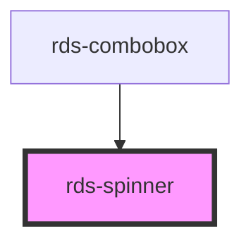

## rds-spinner Readme

<!-- Auto Generated Below -->

### Properties

| Property | Attribute | Description                                                                                               | Type                           | Default |
| -------- | --------- | --------------------------------------------------------------------------------------------------------- | ------------------------------ | ------- |
| `size`   | `size`    | Set the size of the spinner.  Default: md (48x48)  Values: sm (32x32), md (48x48), lg (64x64), xl (80x80) | `"lg" , "md" , "sm" , "xl"` | `'md'`  |

### Dependencies

#### Used by

 - [rds-combobox](../rds-form-elements/rds-combobox)

#### Graph

----------------------------------------------

_Built for Resilience Design System @ FM Global_
