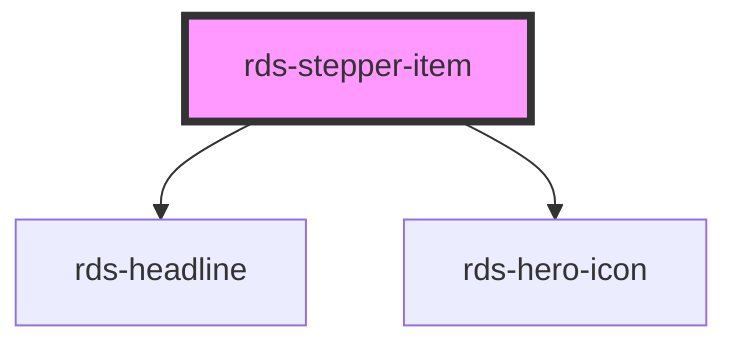

## rds-stepper-item Readme

<rds-alert appearance="info" visible>
  
    React Integration Notes
  
  
    Component events can be used two ways:   
    Events will commonly be used as a React prop, in which case, they will be prefixed with 'on' and use camel case. Example: The React prop for the event `rdsOnChange` is `onRdsOnChange`.   
    Alternatively, you can attach an event listener to the component, in which case the event name remains the same.
  
</rds-alert>

<!-- Auto Generated Below -->

### Properties

| Property      | Attribute     | Description                                                                                                                                                             | Type                         | Default     |
| ------------- | ------------- | ----------------------------------------------------------------------------------------------------------------------------------------------------------------------- | ---------------------------- | ----------- |
| `active`      | `active`      | If `true`, the step is active.                                                                                                                                          | `boolean`                    | `false`     |
| `complete`    | `complete`    | If `true`, the step been completed.                                                                                                                                     | `boolean`                    | `false`     |
| `description` | `description` | **[DEPRECATED]** Sets a complex stepper item's description text. Note: This will only apply to stepper's with `type='complex'`   | `string`                     | `undefined` |
| `disabled`    | `disabled`    | Determines if this stepper item is disabled and not engageable by the user.                                                                                             | `boolean`                    | `false`     |
| `icon`        | `icon`        | Pass the name of the hero icon you'd like displayed. Note: This will only apply to stepper's with the default `type` of _simple_.                                       | `string`                     | `'check'`   |
| `level`       | `level`       | Sets the simple stepper's headline level.                                                                                                                               | `1 , 2 , 3 , 4 , 5 , 6` | `4`         |
| `text`        | `text`        | Sets the stepper item's title text.                                                                                                                                     | `string`                     | `undefined` |

### Events

| Event                  | Description                                       | Type               |
| ---------------------- | ------------------------------------------------- | ------------------ |
| `rdsStepperItemSelect` | Event is emitted when a stepper item is selected. | `CustomEvent<any>` |

### Slots

| Slot            | Description                                                                                                                                                         |
| --------------- | ------------------------------------------------------------------------------------------------------------------------------------------------------------------- |
| `"action"`      | Use this slot to add an action to your stepper item. This slot is valid for **vertical circle** steppers only and displays to the right of the component's content. |
| `"description"` | Use this slot to add a descrition to your stepper item. This slot is valid for **complex** and **vertical circle** steppers.                                        |

### Shadow Parts

| Part                      | Description |
| ------------------------- | ----------- |
| `"circle-step-connector"` |             |

### Dependencies

#### Depends on

- [rds-headline](../rds-headline)
- [rds-hero-icon](../rds-hero-icon)

#### Graph

----------------------------------------------

_Built for Resilience Design System @ FM Global_
