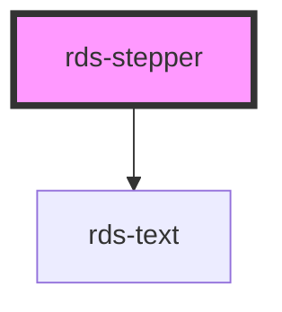

## rds-stepper Readme

<rds-alert appearance="info" visible>
  
    React Integration Notes
  
  
    Component events can be used two ways:   
    Events will commonly be used as a React prop, in which case, they will be prefixed with 'on' and use camel case. Example: The React prop for the event `rdsOnChange` is `onRdsOnChange`.   
    Alternatively, you can attach an event listener to the component, in which case the event name remains the same.
  
</rds-alert>

<!-- Auto Generated Below -->

### Properties

| Property   | Attribute  | Description                                                                                                        | Type                                            | Default     |
| ---------- | ---------- | ------------------------------------------------------------------------------------------------------------------ | ----------------------------------------------- | ----------- |
| `type`     | `type`     | Sets the type of the stepper.                                                                                      | `"bullet" , "circle" , "complex" , "simple"` | `'simple'`  |
| `vertical` | `vertical` | For complex, bullet, and circle steppers. If true, will display stepper vertically and with the stepper item text. | `boolean`                                       | `undefined` |

### Methods

#### `endStep() => Promise<void>`

Sets the last step as active.

##### Returns

Type: `Promise<void>`

#### `goToStep(num: number) => Promise<void>`

Sets the requested step as active.

##### Returns

Type: `Promise<void>`

#### `nextStep() => Promise<void>`

Sets the next step as active.

##### Returns

Type: `Promise<void>`

#### `prevStep() => Promise<void>`

Sets the previous step as active.

##### Returns

Type: `Promise<void>`

#### `startStep() => Promise<void>`

Sets the first step as active.

##### Returns

Type: `Promise<void>`

### Slots

| Slot | Description                               |
| ---- | ----------------------------------------- |
|      | Used to add stepper items to the stepper. |

### Dependencies

#### Depends on

- [rds-text](../rds-text)

#### Graph

----------------------------------------------

 
