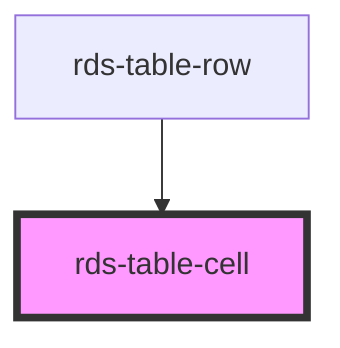

## rds-table-cell Readme

<!-- Auto Generated Below -->

### Properties

| Property     | Attribute     | Description                                                                             | Type      | Default  |
| ------------ | ------------- | --------------------------------------------------------------------------------------- | --------- | -------- |
| `align`      | `align`       | Text alignment for the cell. Options are: `"left"` (default), `"center"` and `"right"`. | `string`  | `'left'` |
| `mobileHide` | `mobile-hide` | Hides the column in mobile view when sets to true and cell prop type is head.           | `boolean` | `false`  |
| `type`       | `type`        | Type of the cell. Options are: `"data"` (default) and `"head"`.                         | `string`  | `'data'` |
| `visible`    | `visible`     | If visible is set to `"true"` columns will stack in mobile view .                       | `boolean` | `false`  |

### Slots

| Slot | Description                            |
| ---- | -------------------------------------- |
|      | Used to add content to the table cell. |

### Dependencies

#### Used by

 - [rds-table-row](../rds-table-row)

#### Graph

----------------------------------------------

_Built for Resilience Design System @ FM Global_
