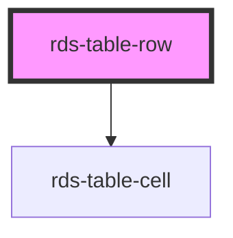

## rds-table-row Readme

<!-- Auto Generated Below -->

### Properties

| Property | Attribute | Description                                                                               | Type      | Default |
| -------- | --------- | ----------------------------------------------------------------------------------------- | --------- | ------- |
| `group`  | `group`   | If group is set to `"true"` cell will take its own full space to cover all the table row. | `boolean` | `false` |

### Slots

| Slot | Description                          |
| ---- | ------------------------------------ |
|      | Used to add table cell's to the row. |

### Dependencies

#### Depends on

- [rds-table-cell](../rds-table-cell)

#### Graph

----------------------------------------------

 
