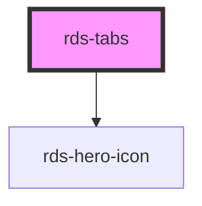

## rds-tabs Readme

<rds-alert appearance="info" visible>
  
    React Integration Notes
  
  
    Component events can be used two ways:   
    Events will commonly be used as a React prop, in which case, they will be prefixed with 'on' and use camel case. Example: The React prop for the event `rdsOnChange` is `onRdsOnChange`.   
    Alternatively, you can attach an event listener to the component, in which case the event name remains the same.
  
</rds-alert>

<!-- Auto Generated Below -->

### Properties

| Property     | Attribute    | Description                                    | Type                                     | Default     |
| ------------ | ------------ | ---------------------------------------------- | ---------------------------------------- | ----------- |
| `appearance` | `appearance` | Sets the appearance type of the tabs container | `"primary" , "secondary" , "tertiary"` | `'primary'` |
| `label`      | `label`      | An accessible label of the tab section.        | `string`                                 | `'Tabs'`    |

### Events

| Event               | Description                                                                | Type                            |
| ------------------- | -------------------------------------------------------------------------- | ------------------------------- |
| `rdsTabsDidChange`  | Emitted when the navigation has finished transitioning to a new component. | `CustomEvent<{ tab: string; }>` |
| `rdsTabsWillChange` | Emitted when the navigation is about to transition to a new component.     | `CustomEvent<{ tab: string; }>` |

### Methods

#### `getSelected() => Promise<string | undefined>`

Get the currently selected tab.

##### Returns

Type: `Promise<string>`

#### `getTab(tab: string | HTMLRdsTabElement) => Promise<HTMLRdsTabElement | undefined>`

Get a specific tab by the value of its `tab` property or an element reference.

##### Returns

Type: `Promise<HTMLRdsTabElement>`

#### `select(tab: string | HTMLRdsTabElement) => Promise<boolean>`

Select a tab by the value of its `tab` property or an element reference.

##### Returns

Type: `Promise<boolean>`

### Slots

| Slot | Description                                                           |
| ---- | --------------------------------------------------------------------- |
|      | Used to add individual tab components to the parent 'tabs' component. |

### Dependencies

#### Depends on

- [rds-hero-icon](../rds-hero-icon)

#### Graph

----------------------------------------------

 
