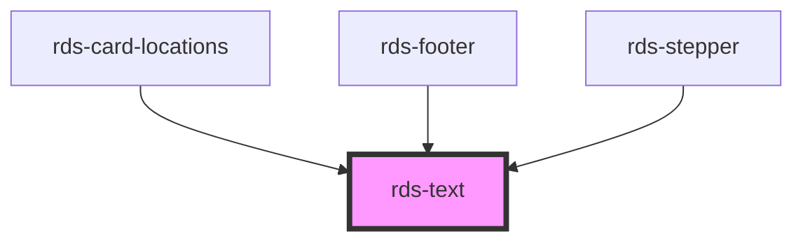

## rds-text Readme

<!-- Auto Generated Below -->

### Properties

| Property  | Attribute | Description                                                                               | Type                                                                                                                                                                                                                                                                                                                                                                                                                                                                                                                                                                                                                                                                                                                                                                                                                                                                                                                           | Default     |
| --------- | --------- | ----------------------------------------------------------------------------------------- | ------------------------------------------------------------------------------------------------------------------------------------------------------------------------------------------------------------------------------------------------------------------------------------------------------------------------------------------------------------------------------------------------------------------------------------------------------------------------------------------------------------------------------------------------------------------------------------------------------------------------------------------------------------------------------------------------------------------------------------------------------------------------------------------------------------------------------------------------------------------------------------------------------------------------------ | ----------- |
| `align`   | `align`   | The alignment of the text. Reflects as a text-align CSS property.                         | `"center" , "inherit" , "justify" , "left" , "right"`                                                                                                                                                                                                                                                                                                                                                                                                                                                                                                                                                                                                                                                                                                                                                                                                                                                                      | `'inherit'` |
| `color`   | `color`   | Controls the text color.                                                                  | `"black" , "white" , "gray-900" , "gray-800" , "gray-700" , "gray-600" , "gray-500" , "gray-400" , "gray-300" , "gray-200" , "gray-100" , "gray-50" , "purple-900" , "purple-800" , "purple-700" , "purple-600" , "purple-500" , "purple-400" , "purple-300" , "purple-200" , "purple-100" , "purple-50" , "blue-900" , "blue-800" , "blue-700" , "blue-600" , "blue-500" , "blue-400" , "blue-300" , "blue-200" , "blue-100" , "blue-50" , "green-900" , "green-800" , "green-700" , "green-600" , "green-500" , "green-400" , "green-300" , "green-200" , "green-100" , "green-50" , "yellow-900" , "yellow-800" , "yellow-700" , "yellow-600" , "yellow-500" , "yellow-400" , "yellow-300" , "yellow-200" , "yellow-100" , "yellow-50" , "red-900" , "red-800" , "red-700" , "red-600" , "red-500" , "red-400" , "red-300" , "red-200" , "red-100" , "red-50"` | `undefined` |
| `size`    | `size`    | The size of the text. Reflects as a font-size CSS property.                               | `"2xl" , "3xl" , "4xl" , "5xl" , "6xl" , "7xl" , "base" , "lg" , "sm" , "xl" , "xs" , "xxs"`                                                                                                                                                                                                                                                                                                                                                                                                                                                                                                                                                                                                                                                                                                                                                                                                                        | `'base'`    |
| `spacing` | `spacing` | The spacing of the text. Spacing controls the top and bottom margin on the headline tags. | `"lg" , "md" , "none" , "sm"`                                                                                                                                                                                                                                                                                                                                                                                                                                                                                                                                                                                                                                                                                                                                                                                                                                                                                               | `'md'`      |
| `type`    | `type`    | The tag type of the text. `inline` returns a span tag. `p` renders a p tag.               | `"inline" , "p"`                                                                                                                                                                                                                                                                                                                                                                                                                                                                                                                                                                                                                                                                                                                                                                                                                                                                                                              | `'p'`       |
| `weight`  | `weight`  | The weight for the text.                                                                  | `"bold" , "extrabold" , "medium" , "normal" , "semibold"`                                                                                                                                                                                                                                                                                                                                                                                                                                                                                                                                                                                                                                                                                                                                                                                                                                                                  | `'normal'`  |

### Slots

| Slot | Description                        |
| ---- | ---------------------------------- |
|      | Used to add text to the component. |

### Dependencies

#### Used by

 - [rds-card-locations](../rds-card-locations)
 - [rds-footer](../rds-footer)
 - [rds-stepper](../rds-stepper)

#### Graph

----------------------------------------------

_Built for Resilience Design System @ FM Global_
