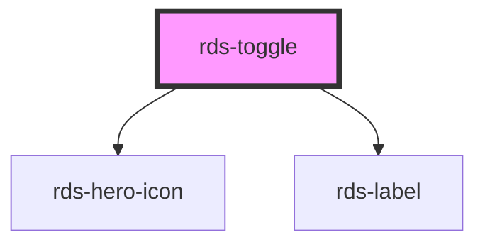

## rds-toggle Readme

<rds-alert appearance="info" visible>
  
    React Integration Notes
  
  
    Component events can be used two ways:   
    Events will commonly be used as a React prop, in which case, they will be prefixed with 'on' and use camel case. Example: The React prop for the event `rdsOnChange` is `onRdsOnChange`.   
    Alternatively, you can attach an event listener to the component, in which case the event name remains the same.
  
</rds-alert>

<!-- Auto Generated Below -->

### Properties

| Property   | Attribute  | Description                                       | Type      | Default     |
| ---------- | ---------- | ------------------------------------------------- | --------- | ----------- |
| `disabled` | `disabled` | When true, the user cannot engage with the toggle | `boolean` | `false`     |
| `label`    | `label`    | Label to be displayed next to RdsToggle           | `string`  | `null`      |
| `name`     | `name`     | The name of the input for the toggle              | `string`  | `undefined` |
| `switched` | `switched` | When true, the toggle will display as switched.   | `boolean` | `false`     |
| `value`    | `value`    | The value of the input for the toggle             | `any`     | `undefined` |

### Events

| Event             | Description                                | Type               |
| ----------------- | ------------------------------------------ | ------------------ |
| `rdsSwitchChange` | Fires when the switched value has changed. | `CustomEvent<any>` |

### Dependencies

#### Depends on

- [rds-hero-icon](../rds-hero-icon)
- [rds-label](../rds-form-elements/rds-label)

#### Graph

----------------------------------------------

_Built for Resilience Design System @ FM Global_
