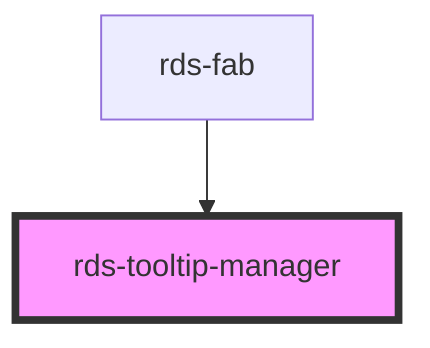

# tooltip-manager

<!-- Auto Generated Below -->

### Properties

| Property   | Attribute  | Description                                                                                                                                              | Type     | Default                          |
| ---------- | ---------- | -------------------------------------------------------------------------------------------------------------------------------------------------------- | -------- | -------------------------------- |
| `selector` | `selector` | CSS Selector to match reference elements for tooltips. Reference elements will be identified by this selector in order to open their associated tooltip. | `string` | ``[data-rds-tooltip-reference]`` |

### Slots

| Slot | Description                                                                            |
| ---- | -------------------------------------------------------------------------------------- |
|      | A slot for adding elements that reference an 'rds-tooltip' by the 'selector' property. |

### Dependencies

#### Used by

 - [rds-fab](../rds-fab)

#### Graph

----------------------------------------------

 
