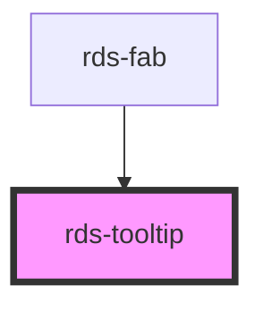

## rds-tooltip Readme

<!-- Auto Generated Below -->

### Properties

| Property             | Attribute             | Description                                                                                                                                                                                                                                                                                                     | Type                                               | Default                 |
| -------------------- | --------------------- | --------------------------------------------------------------------------------------------------------------------------------------------------------------------------------------------------------------------------------------------------------------------------------------------------------------- | -------------------------------------------------- | ----------------------- |
| `label` _(required)_ | `label`               | Accessible name for the component                                                                                                                                                                                                                                                                               | `string`                                           | `undefined`             |
| `offsetDistance`     | `offset-distance`     | Offset the position of the popover away from the reference element.                                                                                                                                                                                                                                             | `number`                                           | `defaultOffsetDistance` |
| `offsetSkidding`     | `offset-skidding`     | Offset the position of the popover along the reference element.                                                                                                                                                                                                                                                 | `number`                                           | `0`                     |
| `open`               | `open`                | Display and position the component.                                                                                                                                                                                                                                                                             | `boolean`                                          | `false`                 |
| `overlayPositioning` | `overlay-positioning` | Describes the type of positioning to use for the overlaid content. If your element is in a fixed container, use the 'fixed' value.                                                                                                                                                                              | `"absolute" , "fixed"`                            | `'absolute'`            |
| `position`           | `position`            | Determines where the component will be positioned relative to the referenceElement.                                                                                                                                                                                                                             | `"auto" , "bottom" , "left" , "right" , "top"` | `'auto'`                |
| `referenceElement`   | `reference-element`   | Reference HTMLElement used to position this component according to the placement property. As a convenience, a string ID of the reference element can be used. However, setting this property to use an HTMLElement is preferred so that the component does not need to query the DOM for the referenceElement. | `HTMLElement , string`                            | `undefined`             |
| `size`               | `size`                | **[DEPRECATED]**   Size sets the max-width of the tooltip container. The available options are sm, md and lg.                                                                                                                                                            | `"lg" , "md" , "sm"`                             | `'md'`                  |
| `text`               | `text`                | **[DEPRECATED]**   Tooltip Text. Text can be displayed by simply placing the text inside of the Tooltip.                                                                                                                                                                 | `string`                                           | `undefined`             |

### Events

| Event               | Description                           | Type                      |
| ------------------- | ------------------------------------- | ------------------------- |
| `rdsTooltipOnBlur`  | Emitted when the Tooltip loses focus. | `CustomEvent<FocusEvent>` |
| `rdsTooltipOnFocus` | Emitted when the Tooltip has focus.   | `CustomEvent<FocusEvent>` |

### Methods

#### `reposition() => Promise<void>`

##### Returns

Type: `Promise<void>`

### Slots

| Slot | Description                         |
| ---- | ----------------------------------- |
|      | Used to add content to the tooltip. |

### Dependencies

#### Used by

 - [rds-fab](../rds-fab)

#### Graph

----------------------------------------------

_Built for Resilience Design System @ FM Global_
